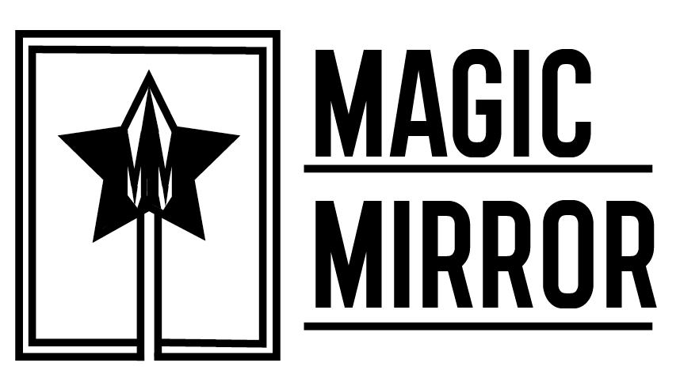

# MagicMirror
Welcome to our Magic Mirror open source project. This is intended to be an easier alternative to the [MagicMirror²](https://github.com/MichMich/MagicMirror) modular smart mirror platform. You can read more about what software we use and why we use it in the [wiki](https://github.com/Rundez/MagicMirror/wiki)

# How to install for MacOS/Ubuntu
1. Clone the project
2. Install python3. With homebrew: <brew install python3>
3. pip install bottle
4. Run the app.py file and the server will launch at localhost! 

# How to install for Windows
1. Clone the project
2. Install python 3, current version for windows: https://www.python.org/downloads/release/python-382/
3. pip install bottle
4. Run the app.py file and the server will launch at localhost! 

# How to add your own template
* Navigate to the "views" folder.
* Create a .tpl file. This is a template file that is written in HTML.
* Define a route to the template in app.py, with the Bottle framework. Example: designs/design6
* Explore your inner creativity and make som magic designs!

# How can I contribute?
1. Download the project
2. Create a development branch where you describe the feature or problem you are working on. 
3. If the problem lies under "issues", assign yourself to the problem. 
4. Create a pull request and wait for it to be reviewed. 
5. Wait for it....
6. PROFIT! 
